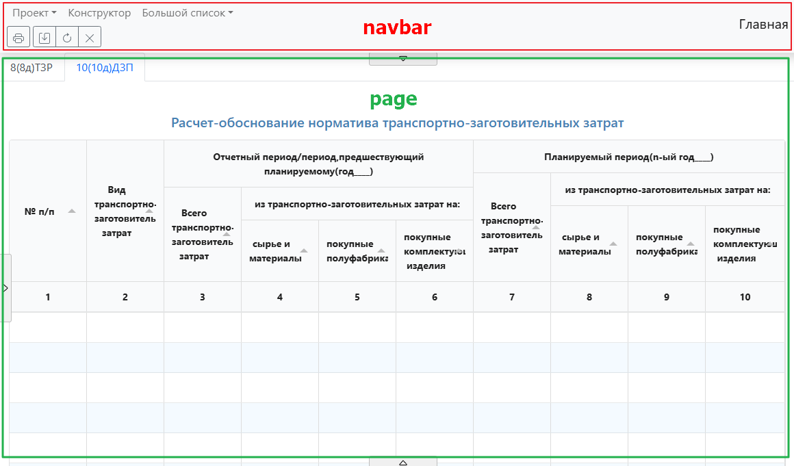
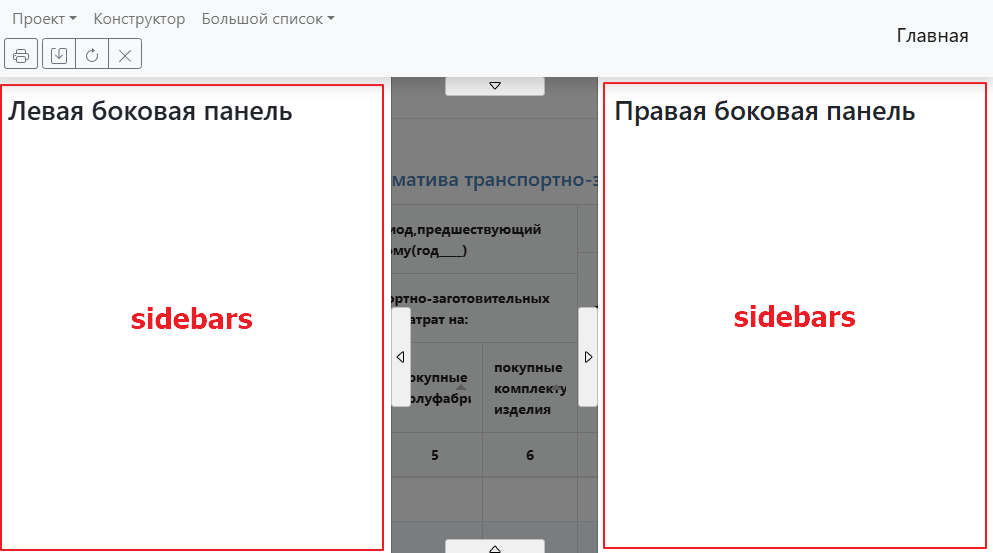
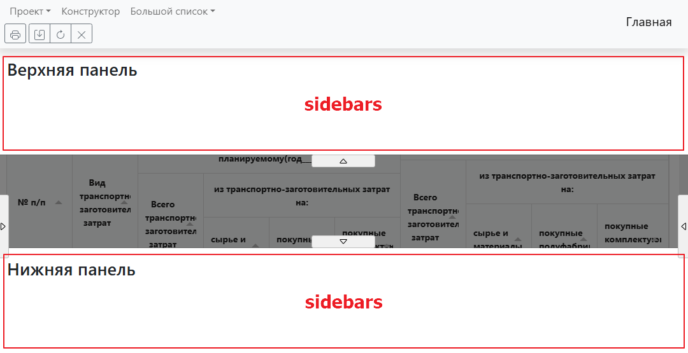
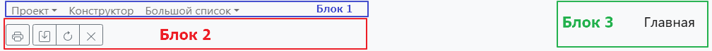

## Документация по JSON конфигурации

Данная документация описывает структуру JSON конфигурации для настройки интерфейса страницы. Конфигурация включает различные элементы, такие как заголовки, боковые панели, кнопки и выпадающие списки.

### Структура конфигурации

Конфигурация представлена в виде объекта, состоящего из трех полей: `navbar`, `sidebars`, `page`.

Общий вид конфигураци:

```
{
    navbar: []
    sidebars: [],
    page: [],
}
```
Каждая секция представляет из себя отдельные блоки страницы, в которые можно добавлять элементы

За что отвечает каждая секция:




### navbar

Верхняя навигационная панель.

В данную область могут быть долбавленны только следующие типы элементов:

`title`

`dropdown-button`

`button-group`

`dropdown`

`link`

Другие типы элементов будут игнорироваться

Общая схема верхней панели:


В __Блок 1__ будут добавляться все элементы следующих типов:

`dropdown`

`link`

В __Блок 2__ будут добавляться все элементы следующих типов:

`dropdown-button`

`button-group`

В __Блок 3__ будут добавляться все элементы следующих типов:

`title`

_Примечание:_ Элемент `title` д.б только один, если их будет несколько, то в __Блок 3__ будет добавлен последний описанный в конфигурации элемент

### sidebars

Выезжающие панели страницы

...

### page

Основная область страницы

...

### Элементы интерфейса

Тут будет описание всех элементов, верхние разделы будут ссылаться на описание элеметов сюда

...

# Старое описание(устаревшее)
Общий вид элемента:

```
        {
            name: sting
            type: string,
            elemtype: string,
            class: string,
            icon: string,
            items: array
        }
```

1. `name` (string): Название элемента. Может быть пустым для некоторых типов элементов. ПОД ВОПРОСОМ

2. `type` (string): Тип элемента. Возможные значения:

   • `title`: Заголовок.

   • `sidebar`: Боковая панель.

   • `button`: Кнопка.

   • `dropdown`: Выпадающий список.

   • `link`: Ссылка.

   • `button-group`: Группа кнопок.

   • `table`: таблица.

3. `elemtype` (string): ПОД ВОПРОСОМ Подтип элемента, который определяет его визуальное представление. Возможные значения:

	• `title`

	• `sidebar`

	• `button`

	• `link`

	• `button-group`

5. `id` (string): Уникальный идентификатор элемента

7. `clas` (string): CSS класс для стилизации элемента (опционально).

8. `status` (string): Статус элемента. Возможные значения:

   • `enabled`: Элемент доступен для взаимодействия.

   • `unable`: Элемент недоступен для взаимодействия.

9. `multiselect` (boolean): Указывает, можно ли выбрать несколько элементов (только для выпадающих списков).

10. `multilevel` (boolean): Указывает, поддерживает ли элемент многоуровневую структуру (только для выпадающих списков).

11. `items` (array): Массив подэлементов (например, элементы выпадающего списка или кнопок в группе).

12. `action` (object): Объект, описывающий действие, выполняемое при взаимодействии с элементом (только для ссылок).

### Пример конфигурации
```
    "layout": [
        {
            "name": "Главная",
            "type": "title",
            "position": "right",
            "elemtype": "title"
        },
        {
            "id": "sidebarID",
            "type": "sidebar",
            "elemtype": "sidebar",
            "position": "top"
        },
        {
            "id": "sidebarID_2",
            "type": "sidebar",
            "elemtype": "sidebar",
            "position": "end"
        },
        {
            "id": "sidebarID_3",
            "type": "sidebar",
            "elemtype": "sidebar",
            "position": "start"
        },
        {
            "name": "",
            "icon": "svgPrint",
            "class": "secondary",
            "elemtype": "button",
            "type": "dropdown",
            "multiselect": false,
            "multilevel": false,
            "status": "unable",
            "items": []
        },
        {
            "name": "",
            "type": "button-group",
            "elemtype": "button-group",
            "items": []
        },
        {
            "name": "Проект",
            "type": "dropdown",
            "elemtype": "link",
            "multiselect": false,
            "multilevel": true,
            "status": "unable",
            "items": []
        },
        {
            "name": "Конструктор",
            "type": "link",
            "elemtype": "link",
            "status": "unable",
            "action": {}
        },
        {
            "name": "Большой список",
            "type": "dropdown",
            "elemtype": "link",
            "multiselect": false,
            "multilevel": true,
            "status": "unable",
            "items": []
        }
    ]
```

