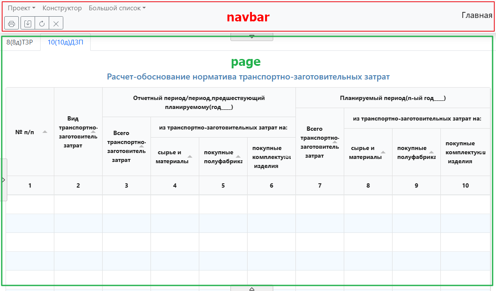
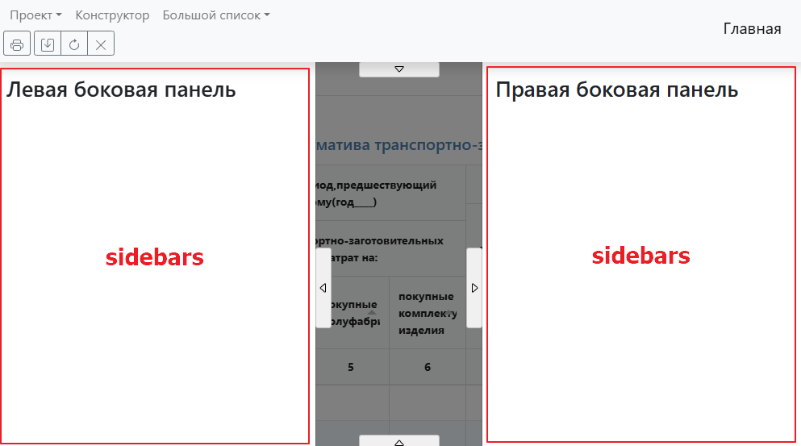
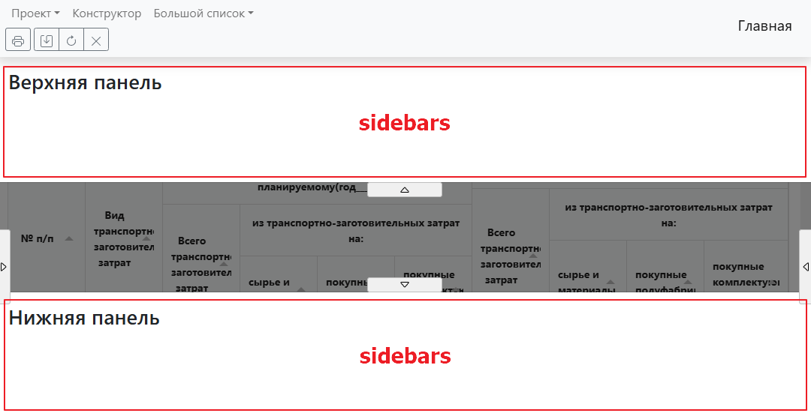
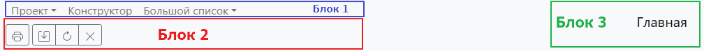

# Документация по JSON конфигурации

### Порядок работы и первоначальная настройка

- перейти в папку example
- выполнить npm i
- для сборки выполнить npm run build

Данная документация описывает структуру JSON конфигурации для настройки интерфейса страницы. Конфигурация включает различные элементы, такие как заголовки, боковые панели, кнопки и выпадающие списки.

## Структура конфигурации

Конфигурация представлена в виде объекта, состоящего из пяти полей: `dataSources`,`pageParams`,`navbar`, `sidebars`, `page`.

Общий вид конфигураци:

```
{
    dataSources: [],
    pageParams: [],
    navbar: {},
    sidebars: [],
    page: []
}
```
Каждая из секций `navbar`, `sidebars`, `page` представляет из себя отдельные блоки страницы, в которые можно добавлять элементы

За что отвечает каждая секция:




## Навигационная панель (navbar)

```
navbar: {
    titlePosition: 'left', // left,right
    menuPosition: 'top',  // top,bottom
    items: []
}
```
### Объяснение структуры

`titlePosition`:(Строка).Необязательное. Возможные значения:

- `'right'` (По умолчанию)
- `'left'`

Определяет размещение области заголовка навигационной панели, если заголовок присутствует.

// TODO: Вставить картинку с примерами

`menuPosition`:(Строка).Необязательное. Возможные значения:

- `'top'` (По умолчанию)
- `'bottom'`

Определяет размещение элемента `menu` и области размещения кнопок(сверху,снизу) в навигационной панели, если присутствует и меню и кнопки.

// TODO: Вставить картинку с примером

`items`: (Массив).

Массив элементов, которые будут добавленны в навигационную панель

> #### В данную область могут быть долбавленны только следующие типы элементов:
> *** 
>- *header*
>- *button*
>- *button-group*
>- *menu*
>- *checkbox*

Другие типы элементов будут игнорироваться

Общая схема верхней панели:


> #### В __Блок 1__ будут добавляться все элементы следующих типов:
> ***
>- *menu*
>- *link*

> #### В __Блок 2__ будут добавляться все элементы следующих типов:
> ***
>- *menu*
>- *button*
>- *checkbox*
>- *button-group*

В __Блок 3__ будут добавляться все элементы следующих типов:

`title`

_Примечание:_ Элемент `title` д.б только один, если их будет несколько, то в __Блок 3__ будет добавлен последний описанный в конфигурации элемент

## Боковые панели (sidebars)

Выезжающие панели страницы

```
sidebars: [
    {
        type: 'sidebar',
        position: 'top', // top, start, end, bottom
        items: []
    },
    ...
]
```
### Объяснение структуры

`position`:(Строка). Возможные значения:
- `'top'`
- `'end'`
- `'botton'`
- `'start'`

Определяет положение боковой панели относительно области page

`items`: (Массив).

Массив элементов, которые будут добавленны в панель

> #### В данную область могут быть долбавленны только следующие типы элементов:
> ***
> - *block*
> - *header*
> - *menu*
> - *tabs*
> - *button*
> - *button-group*
> - *radio-group*
> - *checkbox*
> - *input*
> - *select*
> - *table-tabulator*

## Основная рабочая область страницы(page)

?? Возможно будет описание структуры касаемо разметки ??

## Элементы интерфейса

Общий вид элементов:

```
        {
            type: string,
            items: array
        }
```
1. #### `type` (string): Тип элемента. Возможные значения:
    - `block` : Блок разметки
    - `header` : Заголовок
    - `menu`: Меню
    - `tabs`: Группа вкладок
    - `button`: Кнопка
    - `button-group`: Группа кнопок
    - `radio-group`: Группа радио-кнопок
    - `checkbox`: Чек-бокс
    - `input`: Поле ввода
    - `select`: Выпадающий список
    - `table-tabulator`: Таблица класса Tabulator
2. #### items (array): Массив подэлементов (например, элементы выпадающего списка или кнопок в группе).

### Описание подэлементов
***
- __BLOCK__

    #### Общий вид элемента:
    ```
        {
            type: "block",
            orientation: string,
            items": array
        }
    ``` 
    Описание: 

    - `orientation` (string). Положение контейнера для элементов
        - `'row'` 
        - `'column'`
    - `items` (array). Массив подэлементов любого типа
- __HEADER__        

    #### Общий вид элемента:
    ```
        {
            type: "header",
            text: string,
            size: string
        }
    ```
    - `text` (string). Заголовок  
    - `size` (string). Размер шрифта. Устанавливается в соответствии с высотой текста, указанного в классе .h*.

    ```
    Пример:
    {
        "type": "header",
        "text": "Главная",
        "size": "5"
    }
    ```
- __MENU__   

    #### Общий вид элемента:
     ```
        {
            type: "menu",
            items: array
        }
    ```   
     
    #### Общий вид подэлемента items/submenu:
    ```                        
        {
            title: string,
            action: string,
            url: string,
            config: string,
            newtab: boolean,
            submenu: array
        }
    ```
    // TODO: Вставить картинку с примером
    
    // TODO: Дописать ACTION
    
    - `title`(string). Название
    - `action`(string). Необязательное. Действие, выполняемое при взаимодействии с элементом
    - `url`(string). Необязательное. Указывается только при `action: "redirect"`. Игнорируется, если указан `config`. Переход по ссылке при выборе данного пункта меню.   
    - `config`(string). Необязательное. Указывается только при `action: "redirect"`. Имя конфигурации, которая которая должна загрузиться при выборе данного пункта меню/подменю
    - `newtab`(boolean). Необязательное. Указывается только при `action: "redirect"`. Показатель способа загрузки конфигурации
        - `true` - открыть в новой вкладке
        - `false` - загрузка на этой же странице
    - `submenu`(array). Maссив объектов подпунктов меню
    
    ``` 
    Пример:                       
      {
        type: "menu",
        items: [
          {
            title: "Главная",
            submenu: [
              {
                title: "Проекты",
                submenu: [
                  {
                    title: "ОЭФ",
                    action: "redirect",
                    config: "main_oef",
                    newtab: true
                    submenu: [...]
                  },
                  {
                    title: "Тест",
                    action: "redirect",
                    url:"https://www.wildberries.ru/"
                  }
                ]
              }
            ]
          }
        ]
      }    
    ```
- __TABS__
    #### Общий вид элемента:
     ```
        {
            type: "tabs",
            items: array
        }
    ``` 
    - `items`(array). Массив подэлементов с типом `tab`
    #### Общий вид подэлемента:
    ```
        {
            type: "tab",
            tab_name: string,
            items: [...]
        }
    ```
    - `tab_name`(string). Название вкладки
    - `items`(array). Массив подэлементов любого типа

    ```
    Пример:
        {
            "type": "tabs",
            "items": [
                {
                    type: "tab",
                    tab_name: "НазваниеТаба_1",
                    items: [...]
                },
                {
                    type: "tab",
                    tab_name: "НазваниеТаба_2",
                    items: [...]
                }
            ]   
        }
    ``` 
- __BUTTON__
    
    // TODO: Разобрать ACTION
    #### Общий вид элемента:
     ```
        {
            type: "button",
            icon: string,
            text: string,
            action: string,
            status: string
        }
    ``` 
    - `icon`(string). Необязательное. Имя иконки bootstrap
    - `text`(string). Необязательное. Текст внутри кнопки
    - `action`(string). Действие, выполняемое при взаимодействии с элементом 
    - `status`(string). Активность кнопки
        - `disabled` - кнопка не активна
        - `unabled` - кнопка активна

    ```
    Пример:
        {
            type: "button",
            icon: "printer",
            text: "Кнопка",
            action: "print",
            status: "disabled"
        }
    ``` 
- __BUTTON-GROUP__
    
    // TODO: Разобрать ACTION
    #### Общий вид элемента:
     ```
        {
            type: "button-group",
            items: array
        }
    ``` 

    `items`(array) - массив подэлементов
    #### Общий вид подэлемента:
     ```
        {
            icon: string,
            text: string,
            class: string,
            action: string,
            status: string
        }
    ```     
    - `icon`(string). Необязательное. Имя иконки bootstrap
    - `text`(string). Необязательное. Текст внутри кнопки
    - `class`(string). CSS класс для стилизации элемента (опционально)
        - `primary`
        - `secondary`
        - `success `
        - `info`
        - `warning`
        - `danger`
    - `action`(string). Действие, выполняемое при взаимодействии с элементом 
    - `status`(string). Активность кнопки
        - `disabled` - кнопка не активна
        - `unabled` - кнопка активна

    ```
    Пример:
        {
            type: "button-group",
            items: [
                {
                    text: "кнопка_1",
                    class: "success",
                    icon: "floppy",
                    action: "save",
                    status: "disabled"
                },
                {
                    text: "кнопка_2",
                    icon: "arrow-clockwise",
                    class: "secondary",
                    action: "refresh",
                    status: "unabled"
                },
                ...
            ]
        }
    ``` 
- __RADIO-GROUP__

    #### Общий вид элемента:
    ```
        {
            type: "radio-group",
            name: "radio-name-tab", // возможно, пригодится
            inline: boolean,
            items: []
        }
    ```  
    - `name`(string) - имя родительского таба
    - `inline`(boolean). Необязательное. Отображение элементов.
        - `true` - отображение жлементов по горизонтали
        - `false`(По умолчанию, если свойство отсутствует) - отображение элементов по вертикали
    - `items`(array) - массив попэлементов
    #### Общий вид подэлемента:
    ```
        {
            id: string,
            label: string,
            status: string,
            checked: boolean
        }
    ```
    - `id`(string). Уникальный идентификатом элемента
    - `label`(string). Лэйбл для эелемента
    - `checked`(boolean). Состояние элемента
        - `true` - элемент выбран
        - `false`(по умолчанию, если свойство отсутствует) - элемент не выбран
    - `status`(string). Активность кнопки
        - `disabled` - кнопка не активна
        - `unabled` - кнопка активна
    ```
    Пример
        {
            type: "radio-group",
            name: "radio-name-tab", 
            inline": "form-check-inline",
            items: [
            {
                id: "IDradio_1",
                label: "Радио_1",
                status: "unabled",
                checked: "checked"
            },
            {
                id: "IDradio_1",
                label: "Радио_2",
                status: "unabled",
                checked: ""
            }
            ]
        }
    ```
- __CHECKBOX__
    
    // TODO: Разобрать ACTION
    #### Общий вид элемента:
    ```
        {
            type: "checkbox",
            inline: boolean,
            items": array
        }
    ```    
    - `inline`(boolean). Необязательное. Отображение элементов.
        - `true` - отображение жлементов по горизонтали
        - `false`(По умолчанию, если свойство отсутствует) - отображение элементов по вертикали 
    
    #### Общий вид подэлемента:
     ```
        {
            id: string,
            label: string,
            checked: boolean
            status: "disabled",
            value: string,
            action: string
        }
    ``` 
    - `id`(string). Уникальный идентификатом элемента
    - `label`(string). Лэйбл для эелемента
    - `checked`(boolean). Состояние элемента
        - `true` - элемент выбран
        - `false`(по умолчанию, если свойство отсутствует) - элемент не выбран
    - `status`(string). Активность кнопки
        - `disabled` - кнопка не активна
        - `unabled` - кнопка активна
    - `value`(string). Значение элемента при взаимодействии с ним
    - `action`(string). Действие, выполняемое при взаимодействии с элементом

    ```
    Пример
        {
            type: "checkbox",
            inline: "inline",
            items: [
                {
                    label: "текст_1",
                    id: "chb_1",
                    checked: "checked",
                    status: "disabled",
                    value: string
                },
                {
                    label: "текст_2",
                    id: "chb_2",
                    checked: "",
                    status: "unabled",
                    value: 2
                }
            ]
        }
    ``` 
- __INPUT__
    
    // TODO: Разобрать ACTION
    #### Общий вид элемента:
     ```
        {
            type: "input",
            dataType: string,
            id: string,
            label: string,
            status: string,
            action: string
        }
    ``` 
    - `dataType`(string). Тип поля ввода.
        - `text` - текстовое поле
        - `date` - поле для выбора/ввода даты
        - `number` - числовое поле
        - `file` - поле с загрузкой файла
        - `search` - строка поиска
        
        ..добавить еще типы 
    - `id`(string). Уникальный идентификатор элемента
    - `label`(string). Необязательное. Лэйбл к полю ввода
    - `status`(string). Необязательное. Активность поля
        - `disabled` - поле не активно
        - `unabled`(По умолчанию, если свойство отсутствует) - поле активно
    - `action`(string). Действие, выполняемое при взаимодействии с элементом

    //TODO: сделать везде одинаковый статус активности элементов  
     ```
     Пример:
        {
            type: "input",
            dataType: "number",
            id: "inputId",
            label: "введите что-то там...",
            status: false
        }
    ```  
- __SELECT__

    // TODO: Разобрать ACTION
    #### Общий вид элемента:
     ```
        {
            type: "select",
            label: string,
            labelPosition: string,
            status: string,
            items: array
        }
     ```
     - `label`(string). Необязательное. Лэйбл к полю ввода
     - `labelPosition`(string)
        - `right` - Лэйбл справа от выпадающего списка
        - `left` - Лэйбл слева от выпадающего списка
    - `status`(string). Необязательное. Активность поля
        - `disabled` - поле не активно
        - `unabled`(По умолчанию, если свойство отсутствует) - поле активно
     - `items`(array) - Массив значений подпунктов выпадающего списка

    #### Общий вид подэлемента:
     ```
        {
            "name": string,
            "value": string,
            "selected": boolean
        }
     ```     
     - `name`(string) - Название подпункта выпадающего списка
     - `value`(string) - Значение подпункта выпадающего списка
     - `selected`(boolean)- Состояние активности подпункта 
        - `true` - Элемент выбран
        - `false`(По умолчанию, если свойство отсутствует)
    ```
    Пример:
        {
            type: "select",
            label: "текст_селекта",
            labelPosition: "right",
            items: [
                {
                    name: "значение_1",
                    value: "",
                    selected: "selected"
                },
                {
                    name: "значение_2",
                    value: "",
                    selected: ""
                },
                {
                    name: "значение_3",
                    value: "",
                    selected: ""
                }
            ]
        }
    ```
- __TABLE-TABULATOR__
    
     ```
        {
            type: "table-tabulator",
            id: string,
            action: array,
            name: string,
            indexCols: object,
            tdata: object
        }
     ```
    - `id`(string). Уникальный идентификатор таблицы
    - `action`(array). Массив объектов, описывающих действия, выполняемые при взаимодействии с элементами таблицы
    - `name`(string). Необязательное. Название таблицы
    - `indexCols`(object). Необязательное. Нумерование столбцов таблицы
        ```
        {
            "field_1": 1,
            "field_2": 2,
            "field_3": 2.1,
            "field_4": 2.2,
            "field_5": 3
        }
        ```
    - `tdata`(object). Объект класса Tabulator

    ```
    Пример
        {
            id : "table-tabulator_id_10form",
            type: "table-tabulator",
            name : "Форма 10",
            tdata : {
                data [{},{},{}],
                layout: "fitColumns",
                resizableRows: true,
                columnHeaderVertAlign: "middle",
                columns:[
                    {title:"Поле_1", field:"field_1"},
                    {title:"Поле_2", field:"field_2"},
                    {title:"Поле_3", field:"field_3"},
                    {title:"Поле_4", field:"field_4"},
                    {title:"Поле_5", field:"field_5"}
                ],
                "renderGorizontal": "virtual"
            }
        }   

    ```

## (ACTION) Действия над элементами интерфейса 
- `redirect` - переадресация


***
# Старое описание(устаревшее)
Общий вид элемента:

```
        {
            name: sting
            type: string,
            elemtype: string,
            class: string,
            icon: string,
            items: array
        }
```

1. `name` (string): Название элемента. Может быть пустым для некоторых типов элементов. ПОД ВОПРОСОМ

2. `type` (string): Тип элемента. Возможные значения:

   • `title`: Заголовок.

   • `sidebar`: Боковая панель.

   • `button`: Кнопка.

   • `dropdown`: Выпадающий список.

   • `link`: Ссылка.

   • `button-group`: Группа кнопок.

   • `table`: таблица.

3. `elemtype` (string): ПОД ВОПРОСОМ Подтип элемента, который определяет его визуальное представление. Возможные значения:

	• `title`

	• `sidebar`

	• `button`

	• `link`

	• `button-group`

5. `id` (string): Уникальный идентификатор элемента

7. `clas` (string): CSS класс для стилизации элемента (опционально).

8. `status` (string): Статус элемента. Возможные значения:

   • `enabled`: Элемент доступен для взаимодействия.

   • `unable`: Элемент недоступен для взаимодействия.

9. `multiselect` (boolean): Указывает, можно ли выбрать несколько элементов (только для выпадающих списков).

10. `multilevel` (boolean): Указывает, поддерживает ли элемент многоуровневую структуру (только для выпадающих списков).

11. `items` (array): Массив подэлементов (например, элементы выпадающего списка или кнопок в группе).

12. `action` (object): Объект, описывающий действие, выполняемое при взаимодействии с элементом (только для ссылок).

### Пример конфигурации
```
    "layout": [
        {
            "name": "Главная",
            "type": "title",
            "position": "right",
            "elemtype": "title"
        },
        {
            "id": "sidebarID",
            "type": "sidebar",
            "elemtype": "sidebar",
            "position": "top"
        },
        {
            "id": "sidebarID_2",
            "type": "sidebar",
            "elemtype": "sidebar",
            "position": "end"
        },
        {
            "id": "sidebarID_3",
            "type": "sidebar",
            "elemtype": "sidebar",
            "position": "start"
        },
        {
            "name": "",
            "icon": "svgPrint",
            "class": "secondary",
            "elemtype": "button",
            "type": "dropdown",
            "multiselect": false,
            "multilevel": false,
            "status": "unable",
            "items": []
        },
        {
            "name": "",
            "type": "button-group",
            "elemtype": "button-group",
            "items": []
        },
        {
            "name": "Проект",
            "type": "dropdown",
            "elemtype": "link",
            "multiselect": false,
            "multilevel": true,
            "status": "unable",
            "items": []
        },
        {
            "name": "Конструктор",
            "type": "link",
            "elemtype": "link",
            "status": "unable",
            "action": {}
        },
        {
            "name": "Большой список",
            "type": "dropdown",
            "elemtype": "link",
            "multiselect": false,
            "multilevel": true,
            "status": "unable",
            "items": []
        }
    ]
```

