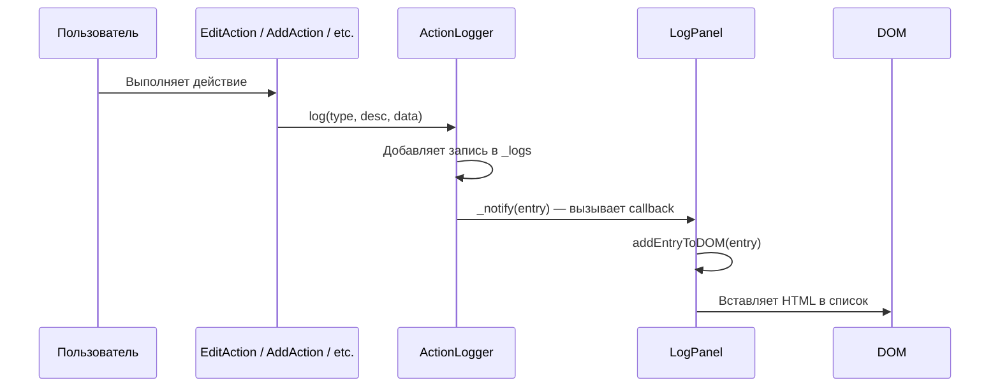

# План реализации: Панель логирования действий пользователя

## 1. Цель

Создать компонент `LogPanel`, который:
- Регистрируется через `PageBuilder.addComponent` как обычный компонент
- Добавляется в JSON-конфиг страницы в секцию `page`
- Отображает список действий пользователя в хронологическом порядке
- Собирает данные для будущей реализации Undo (кнопка "Отмена")
- Не привязан к таблице — логирует ВСЕ действия пользователя

---

## 2. Архитектура: почему два отдельных модуля?

```
ActionLogger (data-слой)          LogPanel (view-слой)
─────────────────────────         ─────────────────────
- Хранит массив записей           - Создаёт DOM-структуру
- Добавляет новые записи          - Подписывается на ActionLogger
- Оповещает подписчиков           - Автоматически обновляет DOM
- Ничего не знает про DOM         - Ничего не знает про хранение
```

**Разделение нужно, чтобы:**
1. ActionLogger можно было использовать без DOM (тесты, консоль, сервер)
2. LogPanel можно было перерисовать без изменения логики хранения
3. В будущем легко добавить новые "подписчики" (например, отправку логов на сервер)

---

## 3. Какие действия логируем

| # | Действие | Компонент | Тип лога | Описание |
|---|----------|-----------|----------|----------|
| 1 | Редактирование строки | `cEditAction.js` | `edit` | "Редактирование строки: {tableId}" |
| 2 | Добавление строки | `cAddAction.js` | `add` | "Добавление строки: {tableId}" |
| 3 | Удаление строки | `cDeleteAction.js` | `delete` | "Удаление строки: {tableId}" |
| 4 | Фильтрация | `cFilterAction.js` | `filter` | "Применение фильтра: {поле} {оператор} {значение}" |
| 5 | Сохранение данных в БД | `cSaveAction.js` | `save` | "Сохранение данных в БД" |
| 6 | Сохранение конфигурации пользователя | `cSaveUserConfigAction.js` | `saveUserConfig` | "Сохранение конфигурации пользователя" |
| 7 | Загрузка конфигурации пользователя | `cLoadUserConfigAction.js` | `loadUserConfig` | "Загрузка конфигурации пользователя" |
| 8 | Сброс/Refresh страницы | `cResetAction.js` | `reset` | "Сброс страницы" |
| 9 | Изменение параметра (select/checkbox/radio/date) | `pageBuilder.js` (`updateParam`) | `paramChange` | "Изменение параметра: {name} = {value}" |
| 10 | Загрузка данных с сервера | `cDataSources.js` (`execute`) | `dataLoad` | "Загрузка данных: {datasourceId}" |
| 11 | Ошибка загрузки данных | `pageBuilder.js` (`loadPageConfig`) | `error` | "Ошибка загрузки конфигурации: {configName}" |
| 12 | Undo (в будущем) | `cUndoAction.js` | `undo` | "Отмена действия: {description}" |

---

## 4. Детальная спецификация модулей

### 4.1. `ActionLogger` — центральный логгер (НОВЫЙ файл)

**Назначение:** Единая точка для записи и хранения логов. Singleton-объект.

```javascript
const ActionLogger = {
  _logs: [],           // массив записей лога
  _maxEntries: 200,    // максимум записей
  _subscribers: [],    // подписчики на новые записи

  /**
   * Добавляет запись в лог и оповещает подписчиков.
   * @param {string} actionType — 'edit' | 'add' | 'delete' | 'filter' | 'save' | ...
   * @param {string} description — человекочитаемое описание
   * @param {object|null} data — полные данные для будущего Undo
   * @returns {object} созданная запись
   */
  log(actionType, description, data) { ... },

  /** Возвращает все записи (новые сверху) */
  getLogs() { ... },

  /** Очищает лог и оповещает подписчиков */
  clear() { ... },

  /** Подписаться на новые записи. callback(entry) вызывается при каждой новой записи */
  subscribe(callback) { ... },

  /** Внутренний метод: оповещает всех подписчиков */
  _notify(entry) { ... }
};
```

**Формат записи:**
```javascript
{
  id: '1721734567890_a1b2c3',     // уникальный ID
  type: 'edit',                    // тип действия
  description: 'Редактирование строки: table_1',  // описание
  data: { tableId: 'table_1', before: {...}, after: {...} },  // для Undo
  timestamp: '12:45:23'           // время
}
```

### 4.2. `LogPanel` — компонент панели (НОВЫЙ файл)

**Назначение:** Визуальный компонент, регистрируемый через `PageBuilder.addComponent`.

**Конструктор:**
```javascript
constructor(parentElement, config) {
  super(parentElement, config);
  this.create();                    // создаёт DOM
  this.subscribeToLogger();         // подписывается на ActionLogger
}
```

**Метод `subscribeToLogger()`:**
```javascript
subscribeToLogger() {
  ActionLogger.subscribe((entry) => {
    if (entry === null) {
      // ActionLogger.clear() — очищаем DOM
      this.clearDOM();
    } else {
      // Новая запись — добавляем в DOM
      this.addEntryToDOM(entry);
    }
  });
}
```

**Конфиг в JSON:**
```json
{
  "type": "logPanel",
  "id": "logPanel1",
  "title": "Лог действий",
  "maxHeight": "300px",
  "showClearButton": true
}
```

**Визуальная структура:**
```
┌──────────────────────────┐
│ 📋 Лог действий    [✕]   │  ← заголовок + кнопка очистки
├──────────────────────────┤
│ 💾 Сохранение данных     │  ← свежие записи сверху
│   в БД                   │
│   12:45:23               │
├──────────────────────────┤
│ 🔄 Сброс страницы        │
│   12:44:15               │
├──────────────────────────┤
│ ✏️ Редактирование        │
│   строки: table_1        │
│   12:42:30               │
├──────────────────────────┤
│ ...                      │
├──────────────────────────┤
│ [Очистить историю]       │
└──────────────────────────┘
```

### 4.3. Поток данных



---

## 5. Состав изменений

### Новые файлы:

| Файл | Описание |
|------|----------|
| `example/src/elements/actionLogger.js` | Центральный логгер (Singleton) |
| `example/src/elements/cLogPanel.js` | Компонент панели логирования |
| `example/src/css/log-panel.css` | Стили для панели логирования |

### Изменяемые файлы:

| Файл | Изменения |
|------|-----------|
| `example/src/elements/cEditAction.js` | Добавить `ActionLogger.log()` в `saveChanges()` |
| `example/src/elements/cAddAction.js` | Добавить `ActionLogger.log()` в `addRow()` |
| `example/src/elements/cDeleteAction.js` | Добавить `ActionLogger.log()` в `deleteSelectedRow()` |
| `example/src/elements/cFilterAction.js` | Добавить `ActionLogger.log()` в `onSave()` |
| `example/src/elements/cSaveAction.js` | Добавить `ActionLogger.log()` в `execute()` |
| `example/src/elements/cSaveUserConfigAction.js` | Добавить `ActionLogger.log()` в `execute()` |
| `example/src/elements/cLoadUserConfigAction.js` | Добавить `ActionLogger.log()` в `execute()` |
| `example/src/elements/cResetAction.js` | Добавить `ActionLogger.log()` в `execute()` |
| `example/src/elements/pageBuilder.js` | Добавить `ActionLogger.log()` в `updateParam()` и `catch` блок `loadPageConfig()` |
| `example/src/elements/cDataSources.js` | Добавить `ActionLogger.log()` в `execute()` |
| `example/src/_app.js` | Добавить `actionLogger.js` и `cLogPanel.js` в сборку |
| `example/src/_app.css` | Добавить `log-panel.css` в сборку |

---

## 6. Todo list

- [ ] Создать `example/src/elements/actionLogger.js` — центральный логгер (Singleton)
- [ ] Создать `example/src/css/log-panel.css` — стили для панели логирования
- [ ] Создать `example/src/elements/cLogPanel.js` — компонент панели логирования
- [ ] Модифицировать `example/src/elements/pageBuilder.js` — добавить `ActionLogger.log()` в `updateParam()` и `catch` блок `loadPageConfig()`
- [ ] Модифицировать `example/src/elements/cDataSources.js` — добавить `ActionLogger.log()` в `execute()`
- [ ] Модифицировать `example/src/elements/cEditAction.js` — добавить `ActionLogger.log()` в `saveChanges()`
- [ ] Модифицировать `example/src/elements/cAddAction.js` — добавить `ActionLogger.log()` в `addRow()`
- [ ] Модифицировать `example/src/elements/cDeleteAction.js` — добавить `ActionLogger.log()` в `deleteSelectedRow()`
- [ ] Модифицировать `example/src/elements/cFilterAction.js` — добавить `ActionLogger.log()` в `onSave()`
- [ ] Модифицировать `example/src/elements/cSaveAction.js` — добавить `ActionLogger.log()` в `execute()`
- [ ] Модифицировать `example/src/elements/cSaveUserConfigAction.js` — добавить `ActionLogger.log()` в `execute()`
- [ ] Модифицировать `example/src/elements/cLoadUserConfigAction.js` — добавить `ActionLogger.log()` в `execute()`
- [ ] Модифицировать `example/src/elements/cResetAction.js` — добавить `ActionLogger.log()` в `execute()`
- [ ] Обновить `example/src/_app.js` — добавить `actionLogger.js` и `cLogPanel.js` в сборку
- [ ] Обновить `example/src/_app.css` — добавить `log-panel.css` в сборку